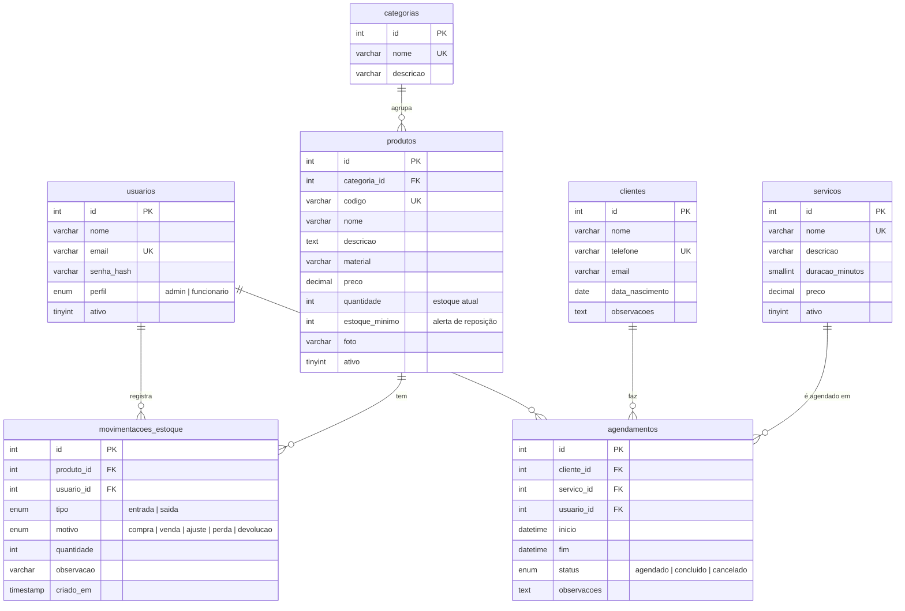

# Modelagem do banco de dados

Banco: **glowbella** (MySQL/MariaDB, `utf8mb4`, InnoDB)

O diagrama abaixo é renderizado automaticamente pelo GitHub.



Todas as tabelas (menos `movimentacoes_estoque`) também têm `criado_em` e `atualizado_em`, preenchidos automaticamente pelo banco.

## Tabelas

| Tabela | Para que serve | Usada em |
|---|---|---|
| `usuarios` | Quem acessa o sistema (dona e funcionárias) | US13 – Login |
| `categorias` | Agrupa os produtos (Brincos, Piercings, Acessórios) | US06 – Produtos |
| `produtos` | Catálogo e estoque atual de cada item | US06, US08, US09 |
| `movimentacoes_estoque` | Histórico de entradas e saídas | US08 – Controle de estoque |
| `clientes` | Cadastro de clientes | US07 – Clientes |
| `servicos` | Serviços que podem ser agendados | US10 – Agendamentos |
| `agendamentos` | Horários marcados | US10, US11 |
| `migracoes` | Controle interno do `database/migrar.php` | — |

## Regras de negócio importantes

**Estoque**
- `produtos.quantidade` é o estoque atual, mas **nunca deve ser alterado diretamente**. Toda mudança acontece junto com um registro em `movimentacoes_estoque`, dentro de uma transação:
  ```php
  $pdo->beginTransaction();
  // 1. INSERT INTO movimentacoes_estoque (...)
  // 2. UPDATE produtos SET quantidade = quantidade + ? WHERE id = ?   (entrada)
  //    UPDATE produtos SET quantidade = quantidade - ? WHERE id = ? AND quantidade >= ?   (saída)
  $pdo->commit();
  ```
- Na saída, se o `UPDATE` não afetar nenhuma linha (`rowCount() === 0`), é porque não há estoque suficiente: faça `rollBack()` e mostre o erro.
- **Estoque baixo** (US09): `quantidade < estoque_minimo`.

**Exclusões**
- Produtos, serviços e usuários **não são apagados**, são desativados (`ativo = 0`). Assim o histórico de movimentações e agendamentos continua existindo.
- As chaves estrangeiras usam `ON DELETE RESTRICT`: o banco impede apagar um cliente que tem agendamentos, ou uma categoria que tem produtos. Trate esse erro mostrando uma mensagem amigável.

**Agendamentos**
- `inicio` e `fim` guardam data e hora. O `fim` pode ser calculado a partir da `duracao_minutos` do serviço.
- **Conflito de horário** (US10): existe conflito se houver algum agendamento não cancelado que se sobreponha ao novo horário:
  ```sql
  SELECT COUNT(*) FROM agendamentos
  WHERE status <> 'cancelado'
    AND inicio < :novo_fim
    AND fim > :novo_inicio
  ```

**Validações garantidas pelo próprio banco**
- Preço de produto e serviço não pode ser negativo.
- Quantidade de uma movimentação precisa ser maior que zero.
- O `fim` do agendamento precisa ser depois do `inicio`.
- E-mail de usuário, telefone de cliente, código de produto e nomes de categoria/serviço não se repetem.

## Pendências a confirmar com o cliente

- **Vendas (US12):** se o cliente quiser o registro de vendas, serão criadas as tabelas `vendas` e `itens_venda`, e `movimentacoes_estoque` ganha uma coluna `venda_id`. Isso será feito em uma migration nova, sem alterar as existentes.
- **Quem atende o agendamento:** hoje `agendamentos.usuario_id` indica quem cadastrou. Se houver mais de uma profissional aplicando piercings, ele pode passar a indicar quem vai atender.
